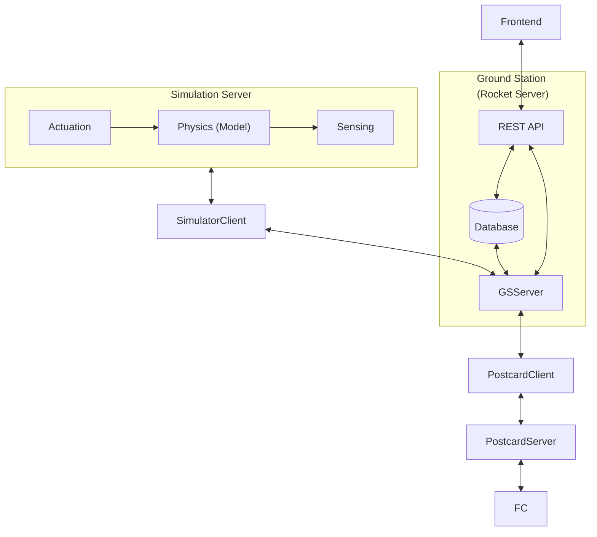

# Architecture

```mermaid
 flowchart TD
    %% Simulation Server (synchronous)
    subgraph SimulatorServer["Simulation Server"]
        Actuation --> Physics["Physics (Model)"]
        Physics --> Sensing
    end

    %% Simulator client/server
    SimulatorServer <--> SimulatorClient
    SimulatorClient <--> GSServer

    %% Rocket Server block
    subgraph RocketServer["Ground Station
    (Rocket Server)"]
        DB[(Database)]
        RESTAPI["REST API"]

        DB <--> GSServer
        RESTAPI <--> GSServer
        RESTAPI <--> DB
    end

    %% Frontend
    Frontend <--> RESTAPI

    %% Postcard pipeline
    GSServer <--> PostcardClient
    PostcardClient <--> PostcardServer
    PostcardServer <--> FC
```

