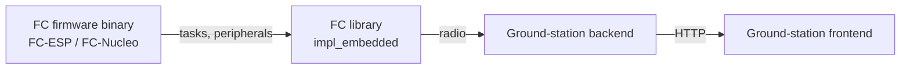
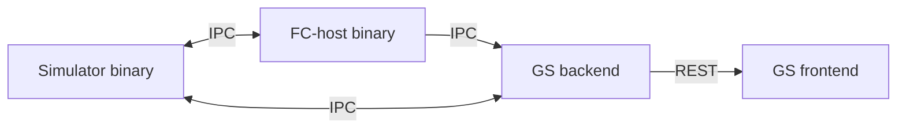
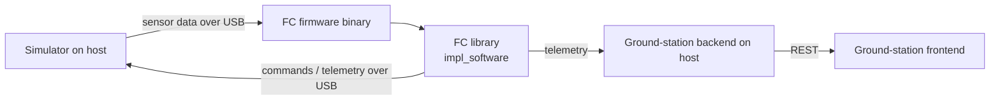

# Deployment modes

The flight computer (FC) library is the same Rust code in every mode below. What changes is *where* it runs, *what* drives its sensor inputs, *who* it talks to over the wire, and *what kind of testing* the mode is meant for. This document pins those three configurations down so that requirements (`[SW-5*]`) and interface decisions can reference them by name.

## Goals

- One FC library, three deployment topologies. The same FC code runs on the real board with real drivers (HW), on the real board with a simulator-fed USB interface (PIL), and on host paired with a separate simulator process (HOST). The only difference is which sensor implementation the FC links against.
- Every mode that needs sensor data uses the **same FC sensor interface**; only the implementation behind it differs (real driver vs. simulator-fed stub).
- The wire formats and command vocabularies (`proto`) are shared across modes so a ground-station UI built for one works in another.
- On host, each role ships as its own binary: flight computer, simulator, ground-station backend, ground-station frontend. They communicate over local IPC using postcard-rpc over [`interprocess`](https://crates.io/crates/interprocess) local sockets — the same RPC framework used on the GS link, with a different transport adapter underneath. The previous design wired them together with library function calls inside a single binary; that is being replaced.
- All testing is done in software. The only hardware ever built is the production avionics board; there are no hardware mocks, fixtures, or stimulator boards.

## Non-goals

- Reproducing the real-time guarantees of hardware in software modes. Host execution is untimed; any timing-sensitive bug must be reproducible on hardware (PIL).
- A separate "unit test" deployment mode. Unit and integration tests of FC logic are `cargo test` runs against the FC library.
- A network-transparent IPC layer. The FC ↔ simulator link on host is local-only (Unix sockets / Windows named pipes via `interprocess`). Cross-machine setups go through the existing radio / USB paths used by HW and PIL.

## What each mode is for

| Mode | Where the FC runs | Sensor source | Filesystem | Primary purpose |
|---|---|---|---|---|
| **HW**   | Flight hardware (MCU) | Real drivers | SD / flash | Flight. The production deployment. |
| **HOST** (a.k.a. SIL / SITL) | Host machine | Simulator (separate process), feeding `Sim*` sensors over local socket | Host FS | Scenario testing — full software stack: FC + simulator + ground-station backend + ground-station frontend, run as in normal flight operation. |
| **PIL**  | Flight hardware (MCU) | Simulator on host, feeding `Sim*` sensors over USB | SD / flash | Performance testing on the real board with a known stimulus. No additional hardware — same prod board. |

There is no mode in which the FC runs without a data source: the FC blocks waiting for sensor data. On host, the simulator must always be running. On hardware, either the real drivers (HW) or a USB-fed simulator (PIL) supplies the data.

## The three modes

### HW — flight hardware

The FC binary runs on the avionics MCU, reads real sensors, drives real actuators, and talks to the ground station over radio. This is the production deployment.

HW itself is the *deployment* target, not a test mode. Confidence in a HW build comes from HOST scenario testing, PIL performance testing on the prod board, and the bring-up / driver tests that ship as standalone embedded binaries.

Bring-up, driver testing, and the prod firmware all live in the per-board `cross-*` crates (`cross-esp32-s3`, `cross-nucleo-f413zh`). Each crate starts as bring-up code for the board, evolves into per-driver tests as drivers are written against `impl_embedded`, and finally graduates into the prod-ready firmware binary. The HW firmware and the PIL firmware are sibling binaries inside the same `cross-*` crate.

### HOST — full software stack on host

Everything runs on the developer's machine: the FC library, the simulator, the ground-station backend, and the ground-station frontend. The simulator drives the FC's sensor inputs via the `Sim*` sensor implementations; the FC's commands feed back into the simulator. The ground-station stack observes and injects commands exactly as it would against a real FC.

HOST is the primary scenario-testing mode: the developer flies a scripted flight, watches it from the ground-station UI, exercises arming / deployment / recovery paths, and verifies the FC's reaction to the simulated physics.

Today HOST is a single binary that wires the simulator and the FC together in-process via Embassy channels — entry point [`start_sil_flight_computer`](../../code/flight-computer/src/tasks/simulation.rs). The next-step direction is to split it into four binaries (FC, simulator, GS backend, GS frontend) connected by postcard-rpc over [`interprocess`](https://crates.io/crates/interprocess) local sockets; see [`fc-simulator-interface.md`](fc-simulator-interface.md) and [ADR-001](../ADR/ADR-001-fc-simulator-postcard-rpc-ipc.md).

Requirements: `[SW-5A]` and its sub-clauses.

### PIL — Processor-in-the-loop

The FC binary runs on the **production avionics hardware**. The simulator stays on host. Sensor data flows from the simulator to the on-board FC over USB; the ground-station backend and frontend run on host as in HOST mode. This exercises everything HOST does *plus* the firmware toolchain, the on-board scheduler, peripheral init, the storage stack, and the radio framing — on the real board, with the real timings.

PIL is the only mode that runs on the prod hardware under a known stimulus, which makes it the right place for **performance testing**: timing, latency, jitter, peripheral init, USB framing, radio framing under load. It is also how firmware-side regressions are caught between flights.

The name is intentional: this is *processor*-in-the-loop, not hardware-in-the-loop. There is no hardware mock — no extra board pretending to be a sensor, no signal injection at the analog layer. The only "hardware" in the loop is the real FC board itself; the sensor data is delivered over USB by software running on the host.

The PIL firmware binary is a sibling of the HW firmware binary inside the same `cross-*` crate, not a build-time feature on the HW firmware: HW links the embedded driver implementations (`impl_embedded`), PIL links the simulator-fed implementations (`impl_software`) with the static `Signal`s fed by a USB postcard receiver instead of an in-process simulator.

The simulator → FC sensor stream rides the **same USB postcard link** the ground station uses. The on-board FC runs a single postcard server that multiplexes telemetry, ground-station commands, and simulator-fed sensor data over one wire — there is no second server and no second link.

## Cross-mode invariants

Visit [`flight-computer.md`](flight-computer.md) for the invariants that apply across all three modes: one library, peripheral-agnostic traits, runtime-agnostic async, architecture-agnostic, single postcard-rpc vocabulary.
