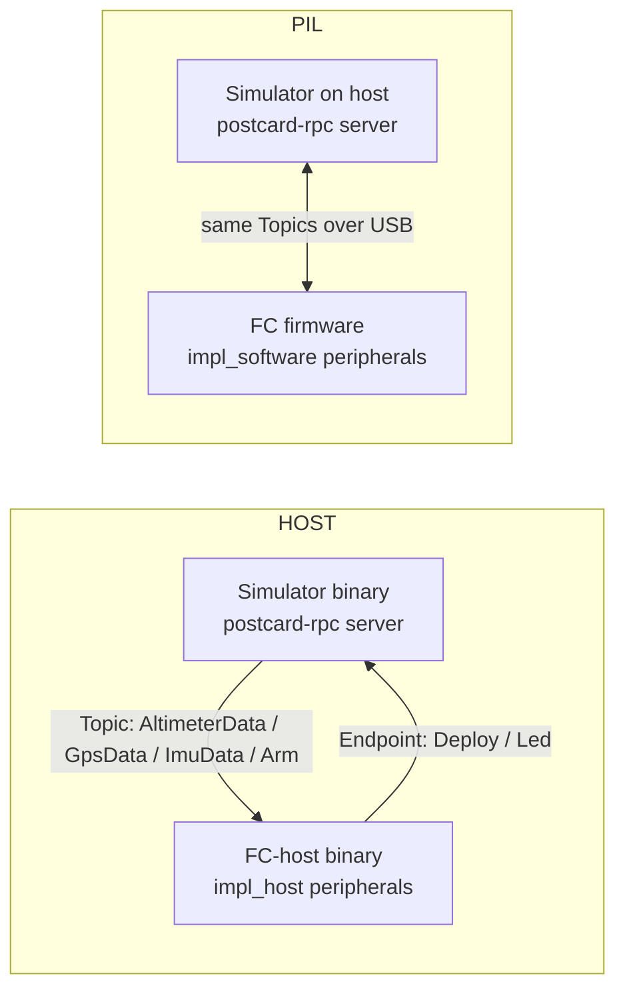
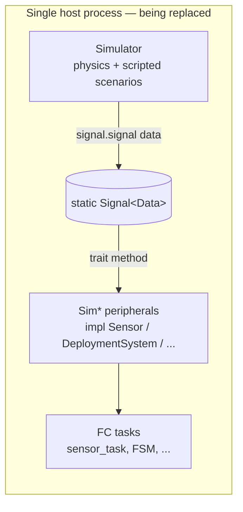

# Flight computer ↔ Simulator interface

The contract the flight computer (FC) exposes to anything that drives its peripherals: real drivers in HW, the simulator in HOST and PIL. This doc pins the *contract*; the decision to split the host build into separate binaries connected by postcard-rpc over local IPC is captured in [ADR-001](../ADR/ADR-001-fc-simulator-postcard-rpc-ipc.md).

For the deployment topologies that consume this contract, see [`deployment-modes.md`](deployment-modes.md).

## Goals

- The FC library never imports the simulator. The contract is a set of traits inside the FC library; the simulator is one possible producer.
- The same FC code runs in HW (real drivers behind the traits) and HOST/PIL (simulator-fed implementations behind the traits), with no mode-specific branches in the FC.
- Both directions — sensor data into the FC, and actuation commands out of the FC — go through traits the FC owns.

## Non-goals

- Real-time fidelity in software modes. Sensor data arrives when the simulator emits it; the FC sees logical samples, not wall-clock-aligned ones.
- A general remoting framework. The interface only needs to carry the message types in `proto/`.

## The contract

Sensors are not the whole story. The FC's full peripheral surface is multi-trait — every trait below has a real-driver implementation for HW and a simulator-fed implementation for HOST/PIL. The only peripheral with a real I/O in every mode is `FileSystem` (host FS in HOST, SD/flash in HW and PIL); it is not part of the FC ↔ simulator contract.

| Trait | Direction | Role |
|---|---|---|
| [`Sensor`](../../code/flight-computer/src/interfaces/sensor.rs) | sim → FC | Periodic sensor data. One impl per device (altimeter, GPS, IMU); each has a `TICK_INTERVAL` and an `async parse_new_data`. |
| [`ArmingSystem`](../../code/flight-computer/src/interfaces/arming_system.rs) | user → FC (via sim) | The FC waits on `wait_arm`; in HOST/PIL the simulator (or scripted scenario / GS operator) signals it. |
| [`DeploymentSystem`](../../code/flight-computer/src/interfaces/deployment_system.rs) | FC → sim | The FC calls `deploy` to fire the parachute / recovery actuator. The simulator observes it. |
| [`Led`](../../code/flight-computer/src/interfaces/led.rs) | FC → sim | Status indicators (`on` / `off` / `toggle`). The simulator surfaces them to the operator. |

Command origins (for the simulator's bookkeeping) are split: **ignition** is user-driven (operator from the GS, or scripted scenario), **deployment** is FC-driven. Both reach the simulator through the same interface, but originate at different ends.

The FC's `sensor_task` polls `Sensor::parse_new_data` on a `Ticker`, broadcasts the result, and toggles a status `Led` — agnostic to who produces the data. The same agnosticism applies to every other trait above.

## Target architecture: postcard-rpc over transport

Each peripheral trait has two simulator-fed implementations, both built on postcard-rpc:

| Implementation | Mode | Transport | Feature flag |
|---|---|---|---|
| `impl_host` | HOST | postcard-rpc over interprocess local socket (`fc-sim.sock`) | `impl_host` |
| `impl_software` | PIL | postcard-rpc over USB (same wire as the GS link) | `impl_software` |

In both cases the peripheral implementation is a postcard-rpc **client**: `Sensor::parse_new_data` awaits a Topic message from the simulator; `DeploymentSystem::deploy` sends an Endpoint request; `ArmingSystem::wait_arm` awaits a Topic message. The FC core is unaware of which transport is underneath.

The simulator is always the postcard-rpc server. The FC binary (host or firmware) is always the client. The simulator listens; the FC connects.

## Current state (transitional)

The HOST binary today wires the simulator and FC into one process using static `embassy_sync::Signal`s. This is the old approach being replaced by the target architecture above.

PIL has no implementation yet. Migration plan: [ADR-001](../ADR/ADR-001-fc-simulator-postcard-rpc-ipc.md). Implementation roadmap: [`../ROADMAP.md`](../ROADMAP.md).

## See also

- [ADR-001](../ADR/ADR-001-fc-simulator-postcard-rpc-ipc.md) — the decision to split host into per-role binaries using postcard-rpc over interprocess local sockets, and the rationale.
- [`deployment-modes.md`](deployment-modes.md) — how this contract is consumed in HW, HOST, and PIL.
- [`../REQUIREMENTS.md`](../REQUIREMENTS.md) `[SW-5A*]` — HOST/PIL test requirements this contract implements.
- [`../../code/flight-computer/src/interfaces/`](../../code/flight-computer/src/interfaces/) — the trait definitions and current implementations.
- [`../../code/simulator/src/`](../../code/simulator/src/) — physics engine, runtime, API.
